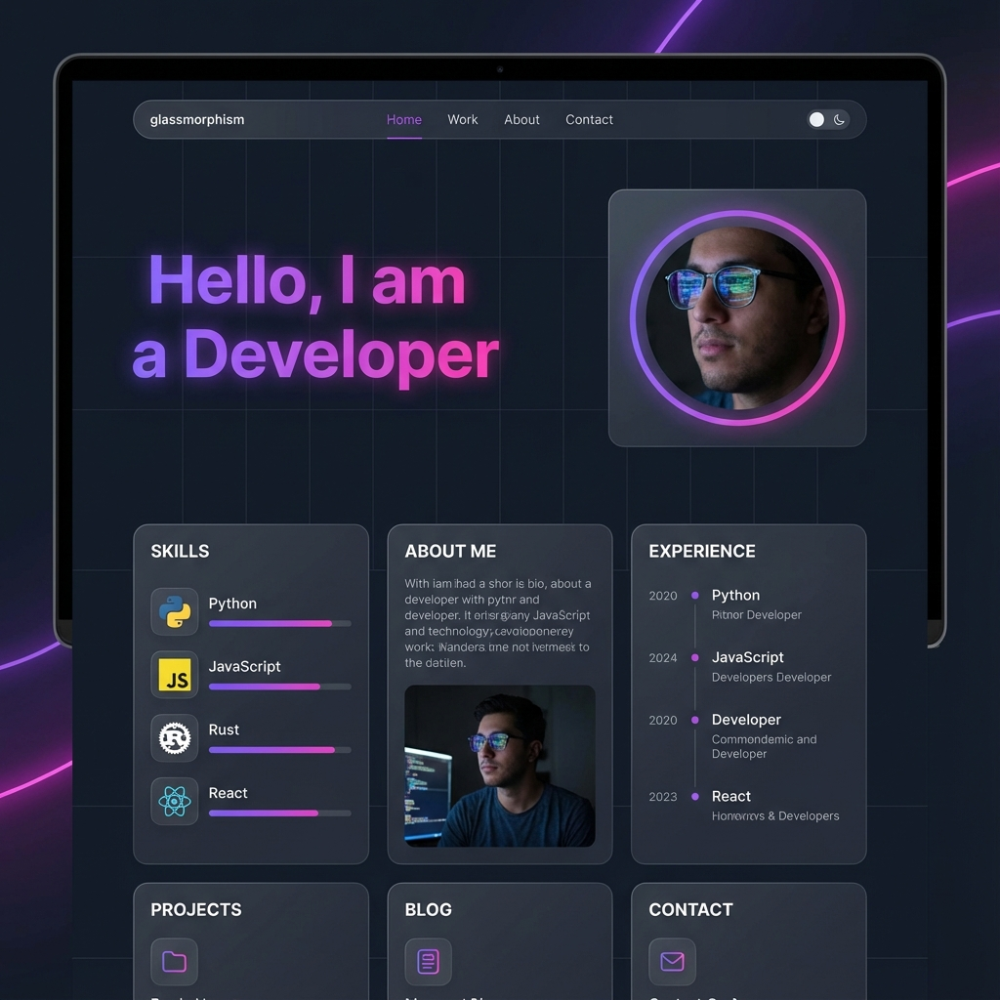

# Portfolio Website - Md. Iftida Hasan Alif

A modern, responsive, and interactive portfolio website built with **React**, **Vite**, and **Tailwind CSS**. This project showcases my skills, projects, and experience in a sleek, dark-themed UI with glassmorphism effects and smooth animations.



## 🚀 Features

- **Modern UI/UX**: Dark theme with violet/fuchsia accents, glassmorphism cards, and animated backgrounds.
- **Responsive Design**: Fully optimized for desktop, tablet, and mobile devices.
- **Bento Grid Layout**: Stylish layout for the "About Me" and "Skills" sections.
- **Project Showcase**: Filterable project gallery (Web, App, Analysis, System).
- **Interactive Elements**: Typing effects, hover animations, and smooth scrolling.
- **Contact Form**: Integrated contact form UI.

## 🛠️ Tech Stack

- **Frontend Framework**: [React](https://react.dev/) (v19)
- **Build Tool**: [Vite](https://vitejs.dev/)
- **Styling**: [Tailwind CSS](https://tailwindcss.com/) (v4)
- **Icons**: [Lucide React](https://lucide.dev/)
- **Linting**: ESLint

## 📋 Requirements

Before you begin, ensure you have the following installed on your machine:

- **Node.js**: v18.0.0 or higher recommended.
- **npm** (Node Package Manager) or **yarn**.

## 💻 Installation

Follow these steps to set up the project locally:

1.  **Clone the repository:**

    ```bash
    git clone https://github.com/your-username/portfolio.git
    cd portfolio/app
    ```

2.  **Install dependencies:**

    ```bash
    npm install
    ```

3.  **Start the development server:**

    ```bash
    npm run dev
    ```

    The application will be available at `http://localhost:5173`.

## 🏗️ Build for Production

To create a production-ready build:

```bash
npm run build
```

To preview the production build locally:

```bash
npm run preview
```

## 📂 Project Structure

```
app/
├── public/              # Static assets
├── src/
│   ├── Portfolio.jsx    # Main Portfolio Component
│   ├── index.css        # Global Styles & Tailwind Imports
│   ├── main.jsx         # Entry Point
│   └── ...
├── package.json         # Project dependencies and scripts
├── vite.config.js       # Vite configuration
└── README.md            # Project documentation
```

## 📄 License

This project is licensed under the MIT License.

---

Developed with ❤️ by **Md. Iftida Hasan Alif**
